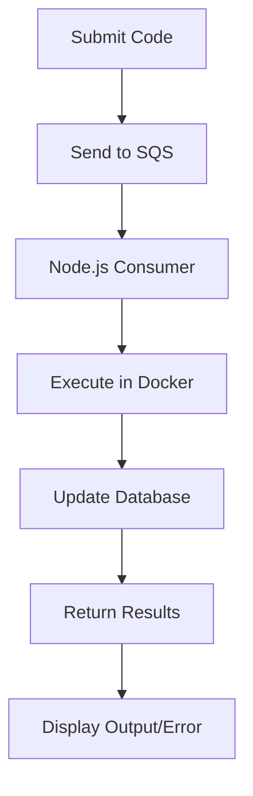

# Code Runner

This is a code runner that integrates a Django backend, a Node.js consumer for executing code, and a React frontend. It allows users to submit code in various programming languages, run the code against predefined test cases, and receive feedback on their submissions.

## Features

- **Multi-language Support**: Run code in multiple programming languages.
- **Test Cases**: Validate code submissions against a set of test cases.
- **User Management**: Keep track of user submissions and results.
- **Error Handling**: Provides detailed error messages for debugging.
- **Asynchronous Processing**: Utilizes SQS for managing code execution requests and responses.

## Getting Started

### Prerequisites

- Node.js (version 16 or higher)
- Docker (for running services)
- Django (for the backend)

### Installation

1. Clone the repository:
   ```bash
   git clone <repository-url>
   cd <repository-directory>
   ```

2. Install dependencies for the backend and frontend:
   ```bash
   npm install
   cd <django-backend-directory>
   pip install -r requirements.txt
   ```

3. Start the services using Docker:
   ```bash
   docker-compose up
   ```

### Usage

- Submit your code through the API endpoint provided by the Django backend.
- The backend sends the code to SQS for processing.
- The Node.js consumer retrieves the code from SQS, executes it in a Docker container for safety, and updates the database with the results.
- The frontend keeps polling for the output or error messages related to the submission.

### Flow Chart




